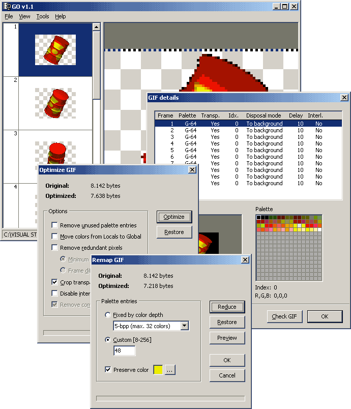



## GIF optimizer 1\.1

### Description

GIF file size optimizer. This is a first release, so, code could be 'optimized' and some 'redundant lines' removed. I've been testing a lot of gifs, and by the moment, all seems to work fine. See 'fMain' for more information. Don't forget to compile first! :-)
 
### More Info
 

             |
---                |---
**Submitted On**   |2003-12-06 22:02:32
**By**             |[Carles P\.V\.](https://github.com/Planet-Source-Code/PSCIndex/blob/master/ByAuthor/carles-p-v.md)
**Level**          |Intermediate
**User Rating**    |5.0 (180 globes from 36 users)
**Compatibility**  |VB 6\.0
**Category**       |[Graphics](https://github.com/Planet-Source-Code/PSCIndex/blob/master/ByCategory/graphics__1-46.md)
**World**          |[Visual Basic](https://github.com/Planet-Source-Code/PSCIndex/blob/master/ByWorld/visual-basic.md)
**Archive File**   |[GIF\_optimi1763026282004\.zip](https://github.com/Planet-Source-Code/carles-p-v-gif-optimizer-1-1__1-47447/archive/master.zip)

